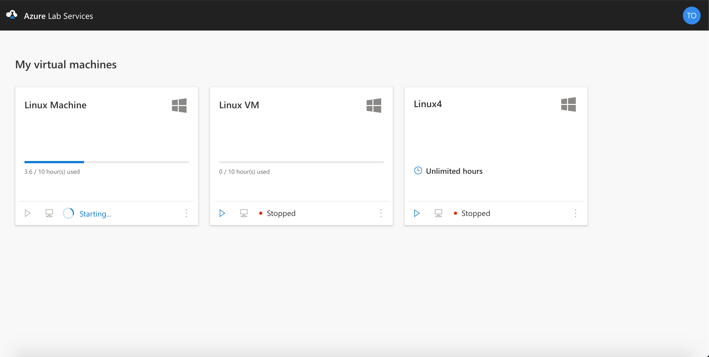
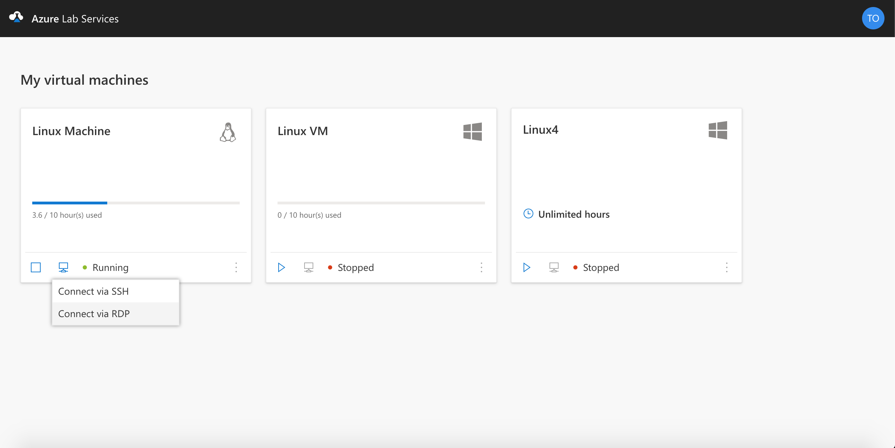
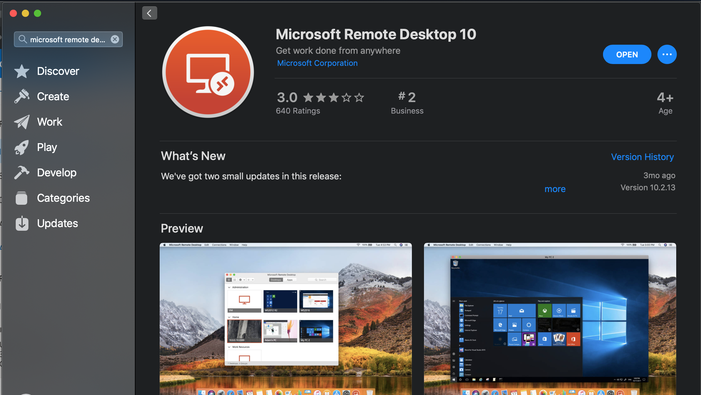
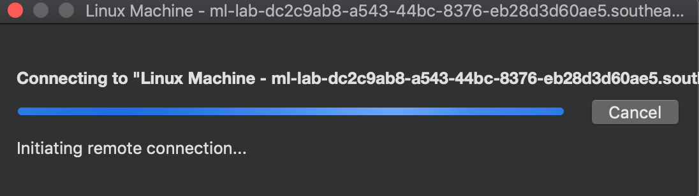
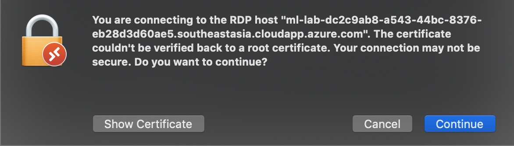

# Tutorial: Connect to a Linux Virtual Machine User Interface using RDP on a Mac 
In this tutorial, you, as a student, connect to a Linux Virtual Machine (VM) User Interface (UI) via a Mac computer. 

In this tutorial, you do the following actions:
> 
> * Install Microsoft Remote Desktop
> * Connect to a Linux VM UI

## Start and Connect to a VM
1. Select **Start** on the tile for the VM of the lab that you want to access. 
    
2. Select **Connect** and choose the **Connect via RDP** option. If you don't see this option, contact your professor and ask them to follow instructions to [enable a Remote Desktop on a Linux VM](https://docs.microsoft.com/en-us/azure/virtual-machines/linux/use-remote-desktop#connect-your-linux-vm-with-a-remote-desktop-client)
    
3. A .rdp file will be downloaded on your computer 

## Install Microsoft Remote Desktop 
1. Open the App Store and search for Microsoft Remote Desktop
    
2. Install the latest version of Microsoft Remote Desktop 

## Access the Linux VM UI 
1. Open the .rdp file downloaded on your computer with Microsoft Remote Desktop. It should start connecting to the VM. 
    
2. Click **Continue** if you receive the below error 
    